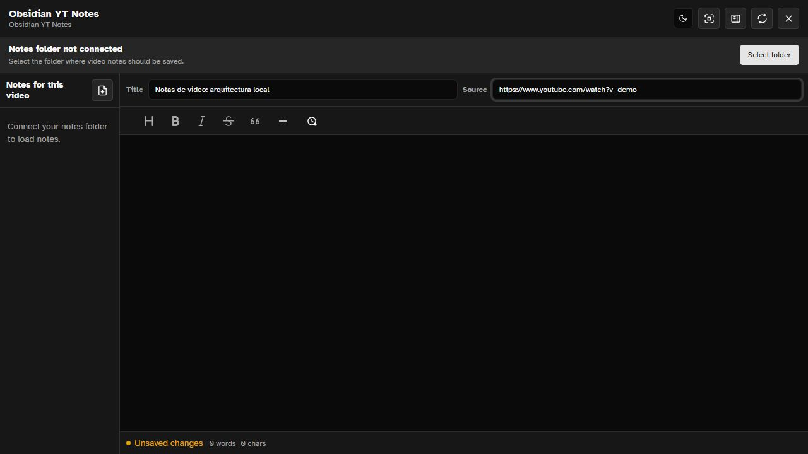

  

# Obsidian YT Notes

Browser extension for taking local Markdown notes while watching videos. Save your notes in the folder you choose, designed to work naturally with an Obsidian vault without relying on external services.

## Features

- Integrated notes panel for videos, with floating mode support.
- Local saving to Markdown files inside a user-selected folder.
- Source metadata to keep the video URL alongside each note.
- Keyboard shortcuts for opening notes, showing the floating button, and controlling playback.
- Timestamp insertion as list items or plain lines.
- Light, dark, and system theme support.
- Blocked sites list for disabling the extension where you do not want it.
- Localized UI through `_locales`.

## Local Installation

1. Download or clone this repository.
2. Open `chrome://extensions` in Chrome, Edge, or any Chromium-compatible browser.
3. Enable **Developer mode**.
4. Click **Load unpacked**.
5. Select the project folder.
6. Open the extension options and choose the folder where your notes should be saved.

To use it with local videos, enable **Allow access to file URLs** from the extension card in `chrome://extensions`.

## Quick Start

- Open a video on YouTube or another platform.
- Use the extension popup to open the notes folder or the current video's notes.
- Connect a local folder when the panel asks for it.
- Write, edit, and save your notes in Markdown.

Default shortcuts:

- `Alt+Shift+O`: open the notes panel.
- `Alt+Shift+F`: open the floating panel.
- `Command+Shift+O` and `Command+Shift+F` on macOS.

## Project Structure

- `manifest.json`: MV3 extension manifest.
- `content-script.js` and `video-hover-button.js`: page and video player integration.
- `editor.html`, `editor.css`, `editor.js`: main notes window.
- `popup.html`, `popup.css`, `popup.js`: extension popup.
- `options.html`, `options.css`, `options.js`: settings page.
- `assets/`: icons, fonts, and visual resources.
- `models/`: local models used by the included detection features.

## Development

No build step is required to test it as an unpacked extension. After editing files, reload the extension from `chrome://extensions` and refresh the page where you are using it.

## License

Add your preferred license here before distributing the project publicly.
